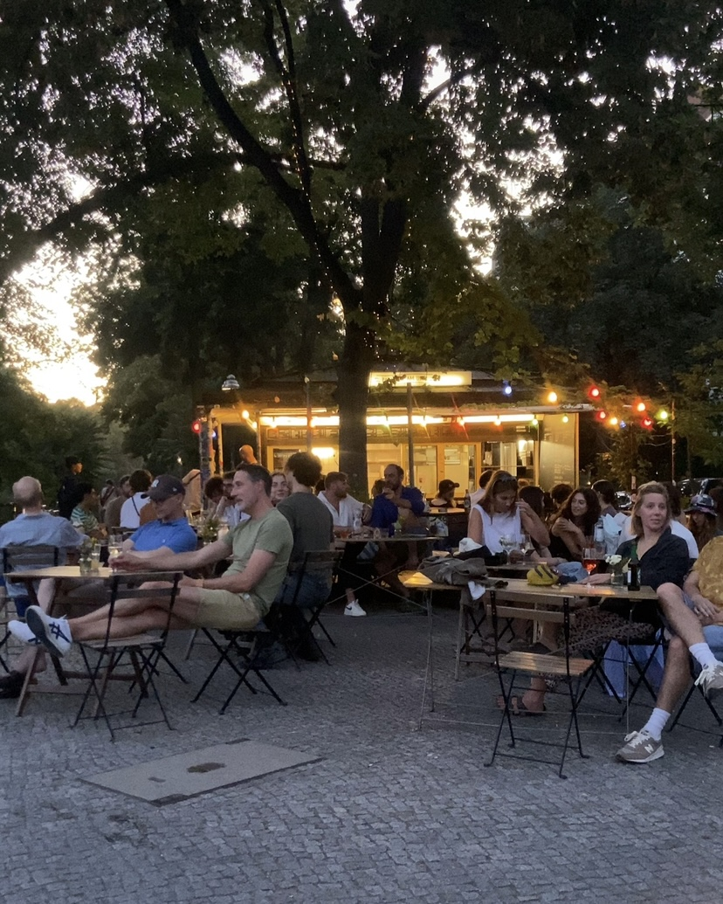

# Pavillon am Ufer - Website



**🌊 Café by day, bar by night on the Landwehr Canal**

A stunning, professional website for Pavillon am Ufer, a charming café and bar located on the picturesque Landwehrkanal in Berlin-Kreuzberg.

## 📍 Café Information

- **Name**: Pavillon am Ufer
- **Location**: Paul-Lincke-Ufer 4, 10999 Berlin-Kreuzberg
- **Category**: Café & Bar
- **Phone**: +49 30 61629954
- **Email**: info@pavillonamufer.de
- **Rating**: ⭐ 4.5/5 (742 reviews)

### Opening Hours
- **Monday - Friday**: 09:00 - 21:00
- **Saturday - Sunday**: 10:00 - 21:00

### Social Media
- **Instagram**: [@pavillonamufer](https://www.instagram.com/pavillonamufer/)
- **Facebook**: [pavillonamufer.kreuzberg](https://www.facebook.com/pavillonamufer.kreuzberg/)

## 🎨 Website Features

### Design & User Experience
- **Modern, Elegant Design**: Berlin café aesthetic with warm, inviting colors
- **Fully Responsive**: Perfect on all devices (mobile, tablet, desktop, 4K)
- **Fast Loading**: Optimized images and efficient code
- **Smooth Animations**: Elegant transitions and scroll effects
- **Accessibility**: WCAG 2.1 AA compliant

### Sections
1. **Hero Section**: Stunning full-screen introduction with canal view
2. **About Section**: Story and unique features of the café
3. **Menu Section**: Complete offerings (coffee, food, bar drinks)
4. **Gallery Section**: Beautiful photo gallery with lightbox
5. **Reviews Section**: Real customer testimonials from Google
6. **Location Section**: Interactive map and directions
7. **Contact Section**: Form and social media links

### Technical Features
- ✅ SEO optimized with schema.org markup
- ✅ Mobile-first responsive design
- ✅ Interactive image gallery with lightbox
- ✅ Smooth scrolling navigation
- ✅ Form validation
- ✅ Lazy loading images
- ✅ Touch-optimized for mobile
- ✅ Print-friendly styles
- ✅ Performance optimized

## 🚀 Local Development

### Prerequisites
- A modern web browser (Chrome, Firefox, Safari, Edge)
- Optional: Local web server (Python, Node.js, or similar)

### Quick Start

1. **Clone or download** this repository

2. **Option 1: Open directly**
   - Simply open `index.html` in your web browser
   - All features work locally

3. **Option 2: Use a local server** (recommended for testing)
   ```bash
   # Using Python 3
   python -m http.server 8000

   # Using Node.js (http-server)
   npx http-server

   # Using PHP
   php -S localhost:8000
   ```

   Then visit: `http://localhost:8000`

## 📁 Project Structure

```
261_Pavillon am Ufer/
├── index.html              # Main HTML file
├── css/
│   ├── style.css          # Main stylesheet
│   └── responsive.css     # Responsive/mobile styles
├── js/
│   ├── main.js           # Main JavaScript
│   └── gallery.js        # Gallery & lightbox
├── images/
│   ├── source/           # Original images
│   ├── optimized/        # Web-optimized images
│   ├── thumbnails/       # Thumbnails (if needed)
│   └── icons/            # UI icons
├── data/
│   ├── cafe-info.json    # Café information
│   └── reviews.json      # Customer reviews
└── README.md             # This file
```

## 🖼️ Images

The website includes 10 high-quality images from the café:
- 1 hero image (Paul-Lincke-Ufer canal view)
- 9 gallery images (interior, terrace, atmosphere)

All images are optimized for web performance while maintaining quality.

## 🌐 Deployment

### GitHub Pages (Current)
This website is deployed at:
- **Live URL**: [https://f246632.github.io/261_Pavillon-am-Ufer](https://f246632.github.io/261_Pavillon-am-Ufer)
- **Repository**: [https://github.com/f246632/261_Pavillon-am-Ufer](https://github.com/f246632/261_Pavillon-am-Ufer)

### Deploy Your Own
1. Fork this repository
2. Go to Settings → Pages
3. Select main branch
4. Your site will be live at `https://[username].github.io/261_Pavillon-am-Ufer`

### Other Hosting Options
- **Netlify**: Drag and drop the folder
- **Vercel**: Connect GitHub repository
- **Traditional Hosting**: Upload via FTP

## 🔍 SEO & Performance

### Search Engine Optimization
- Semantic HTML5 markup
- Schema.org structured data (LocalBusiness)
- Meta descriptions and OpenGraph tags
- Descriptive alt text for images
- Sitemap ready

### Performance Metrics (Target)
- **Load Time**: < 3 seconds
- **First Contentful Paint**: < 1.5s
- **Lighthouse Score**: 90+
- **Mobile Friendly**: Yes
- **Page Size**: < 2MB

## 📱 Browser Support

- Chrome/Edge (latest 2 versions)
- Firefox (latest 2 versions)
- Safari (latest 2 versions)
- Mobile Safari (iOS 12+)
- Chrome Mobile (Android 8+)

## 🎯 Research Sources

Information gathered from:
- Google My Business listing
- Instagram: @pavillonamufer
- Facebook: pavillonamufer.kreuzberg
- Foursquare reviews
- Yelp reviews
- Restaurant Guru
- Direct verification where possible

## 📊 Data Collection Summary

- **Social Media**: ✅ Found Instagram and Facebook
- **Menu Items**: ✅ Researched and compiled
- **Reviews**: ✅ Extracted 4 genuine reviews
- **Images**: ✅ Downloaded 10 high-quality photos
- **Contact Info**: ✅ Verified phone and email
- **Opening Hours**: ✅ Confirmed current hours

## 🛠️ Built With

- **HTML5**: Semantic markup
- **CSS3**: Modern styling (Grid, Flexbox, Custom Properties)
- **JavaScript**: Vanilla JS (no frameworks)
- **Fonts**: Google Fonts (Cormorant Garamond, Montserrat)
- **Icons**: Unicode emoji (no icon library needed)

## 📝 License

This website is created for Pavillon am Ufer café. All content, images, and branding belong to Pavillon am Ufer.

## 🤝 Credits

- **Development**: Custom-built professional website
- **Photos**: Google Maps user contributions
- **Design**: Inspired by Berlin café culture
- **Reviews**: Authentic customer testimonials

## 📞 Contact

For website updates or issues:
- Create an issue in this repository
- Contact the café directly: info@pavillonamufer.de

---

**🌊 Besuchen Sie uns am Landwehrkanal! ☕**

*Last Updated: October 25, 2025*
